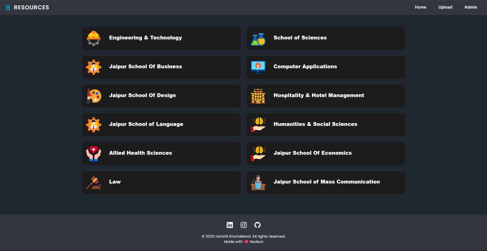

# 🚀 BluecityResources

**BluecityResources** is a Node.js based web application designed for sharing and downloading study resources 📚✨.

## 🛠️ Technologies Used
- ⚙️ **Node.js** for backend server
- 🌐 **Express.js** as the web framework
- 🗄️ **MongoDB** for database storage
- 📝 **EJS & ejs-mate** templating engines for dynamic HTML pages
- 🎨 **HTML, CSS, and JavaScript** for frontend design and interactivity

---

## 🔥 Current Status
- 🚧 The project is **under active development**.
- 🏗️ The new index (home) page is being built to provide a better user experience.
- 📂 Core features like uploading, browsing, and downloading study materials will be added soon.

---

## 📸 Screenshot of Work-in-Progress Page

  
_Current state of the homepage while the new design is being developed._

---

## 🎯 Next Steps
- 🖌️ Complete and polish the homepage and UI components.
- 📥 Implement essential functionalities such as user uploads, downloads, and resource management.
- 🔐 Add user authentication and profiles for a personalized experience.

---

## 💻 How to Run Locally

```bash
git clone https://github.com/HyIAmHarshit/BluecityResources.git
cd BluecityResources
npm install
node app.js
